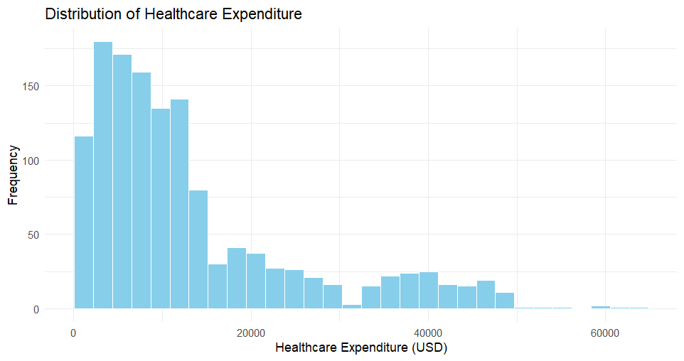
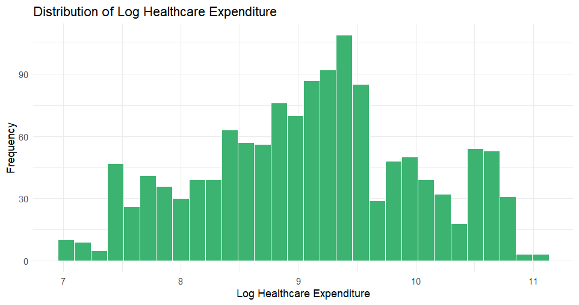

# Healthcare Expenditure Analysis: Smoking, BMI & Age

An econometric analysis of how smoking, BMI, and age relate to healthcare
expenditure, with a focus on whether smoking's association with cost
changes depending on BMI and age.

## Project Overview

Healthcare cost prediction is a common applied problem in insurance and
health economics. This project uses the Medical Cost Personal Dataset to
model log healthcare expenditure as a function of smoking, age, BMI, and
demographic controls, then tests whether smoking's association with cost
varies across BMI and age using interaction terms.

## Research Question

How are smoking, BMI, and age associated with healthcare expenditure, and
does the association between smoking and expenditure vary across age and
BMI?

## Dataset

- **Source:** Medical Cost Personal Dataset
- **Observations:** 1,338 original, 1 duplicate removed → **1,337 final**
- **Variables:** age, sex, BMI, children, smoker, region, charges (USD)
- **Missing values:** none

## Data Cleaning

- Checked for missing values (none found)
- Checked for and removed 1 duplicate row
- Converted `sex`, `smoker`, and `region` to factors
- Log-transformed `charges` (right-skewed) to `log_charges`
- Mean-centered `age` and `bmi` before building interaction terms

## Exploratory Data Analysis




Expenditure is heavily right-skewed and becomes close to symmetric after a
log transform. Smokers show both higher median expenditure and a much
wider spread than non-smokers.

## Econometric Methodology

Seven OLS models are estimated in progression, from a smoking-only
baseline up to a full specification with demographic controls and two
interaction terms:

```
Model 7 (final): log_charges ~ age_c + bmi_c + smoker + sex + children +
                  region + smoker:bmi_c + smoker:age_c
```

- Dependent variable: `log(charges)`
- Age and BMI mean-centered before interactions
- HC1 robust standard errors used due to detected heteroskedasticity

## Regression Results (Model 7)

| Variable | Coefficient | Robust SE | p-value |
|---|---|---|---|
| Age (centered) | 0.0415 | 0.0010 | < .001 |
| BMI (centered) | 0.0012 | 0.0021 | 0.574 |
| Smoker | 1.5338 | 0.0192 | < .001 |
| Smoker × BMI | 0.0510 | 0.0031 | < .001 |
| Smoker × Age | -0.0334 | 0.0014 | < .001 |

R² = 0.825, Adjusted R² = 0.823, n = 1,337

Smoking is associated with roughly a **4.6x** increase in expenditure at
the sample's average age and BMI. That association gets **stronger** at
higher BMI (up to ~5.8x at BMI 35) and **weaker** at higher ages (down to
~2x by age 64).

## Diagnostic Tests

| Test | Result | Interpretation |
|---|---|---|
| VIF (max) | 1.18 | No meaningful multicollinearity |
| Breusch-Pagan | p < .001 | Heteroskedasticity detected → robust SEs used |
| Ramsey RESET | p < .001 | Possible functional-form misspecification (reported, not hidden) |

## Robustness Checks

- **Gamma GLM (log link):** re-estimates the model directly on the charges
  scale. All key variables match the OLS model in sign and significance.
- **Duan's Smearing Correction:** corrects the downward bias from
  exponentiating log-scale predictions, bringing predicted mean
  expenditure much closer to the actual mean.
- **Blinder-Oaxaca decomposition** was explored in the underlying academic
  dissertation but is left out here — it adds complexity without changing
  the conclusions, and the goal of this repo is a project that's easy to
  explain end-to-end.

## Key Findings

1. Smoking is the strongest correlate of healthcare expenditure by far.
2. Age is positively and significantly associated with expenditure
   (~4.2% per year).
3. BMI alone isn't significant, but its interaction with smoking is —
   the two compound each other.
4. The smoking-related cost gap narrows substantially with age.
5. Results are robust to a Gamma GLM specification.

## Tools Used

R · tidyverse (dplyr, ggplot2, readr) · car · lmtest · sandwich · broom ·
R Markdown

## Limitations

- Cross-sectional data — results are associations, not causal effects.
- Limited variable set (no income, pre-existing conditions, etc.)
- Not necessarily a nationally representative sample.
- Significant RESET test suggests the linear specification may not fully
  capture the underlying functional form.

## Conclusion

Smoking, age, and their interactions with BMI and age drive most of the
explainable variation in healthcare expenditure in this dataset. The
smoking association isn't fixed — it shifts with BMI and age — which is a
more useful finding than a single flat "smoking effect," and it holds up
under an alternative Gamma GLM specification.
